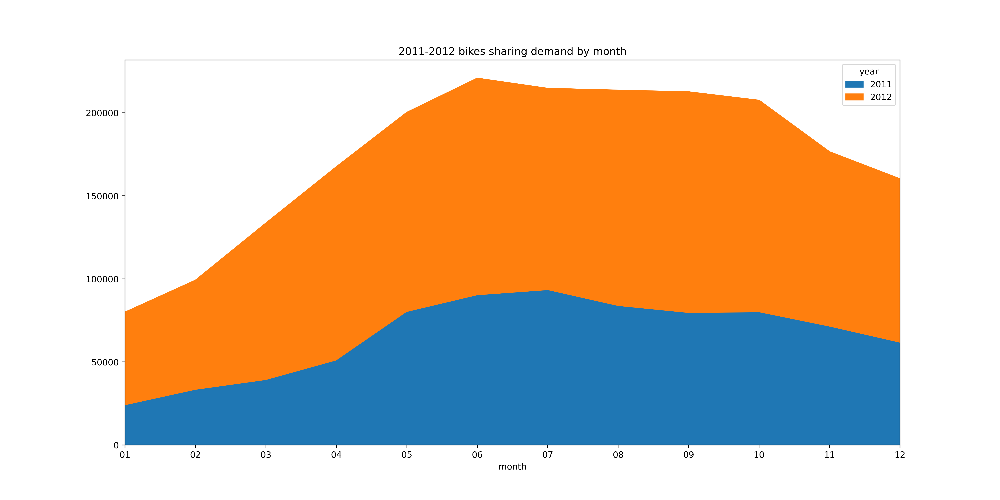
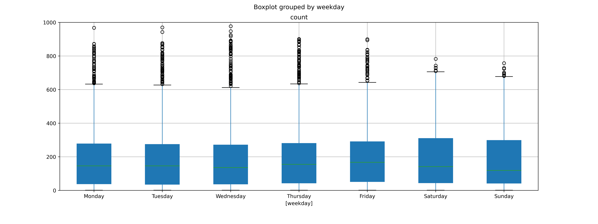
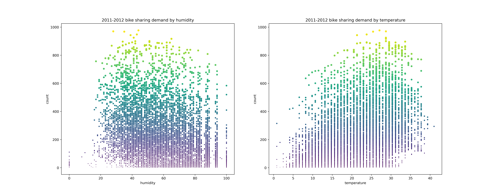
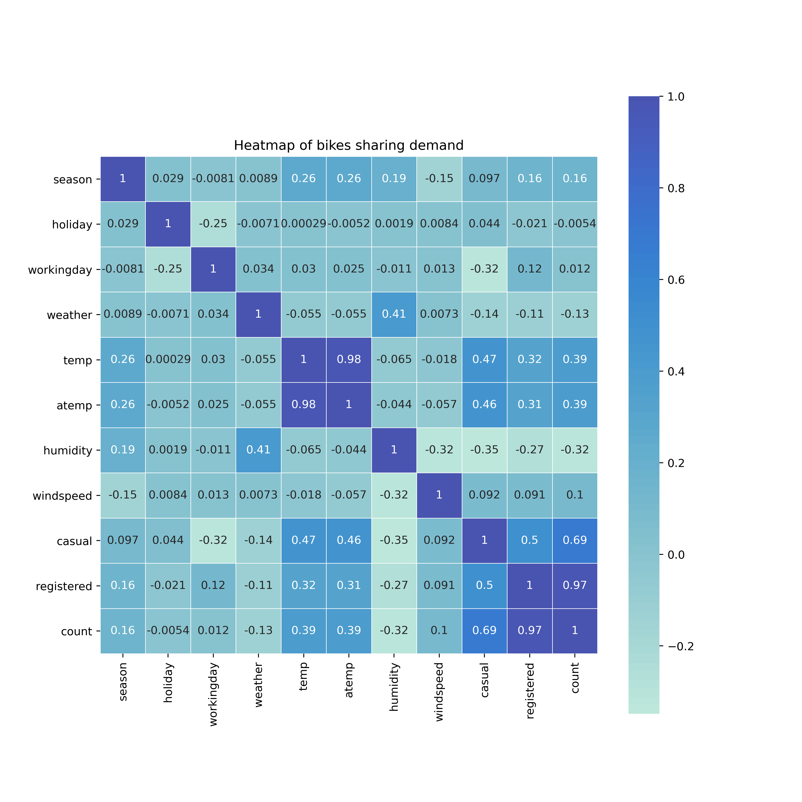

# 数据挖掘导论第一次作业报告

### 概述

该次作业使用的是Kaggle（链接见`README.md`）上的共享单车数据集，并且对其进行了可视化处理，分别从月份、星期、季节等角度绘制了包括区域图、散点图、箱线图、热点图等统计图，以下是通过相关统计图得到的一些结论。

### 年份和月份和租车数量区域图

1. 可以看到2012年的租车数量明显多于2011年；
2. 租车数量主要集中于6-10月份。

### 周一至周日租车箱线图

1. 可以看到虽然周末的上限比其他五天要高，但实际上的中位数、上四分位数、下四分位数相差不多，说明租车数量和是否是周末并无太大关系。

### 四季24小时折线图

1. 可以看到四个季节中，每天单车租赁数量的变化趋势是基本一样的；
2. 对于总的数量来说，秋天租赁的数量最多，春天租赁的数量最少；
3. 一天中租赁的高峰期主要集中于早上8:00和傍晚17:00，这说明单车租赁的高峰是在上班早高峰和下班晚高峰这两个时间点，可以考虑在这两个时间点上增加对应地点的单车数量。

### 温度和湿度散点图

1. 可以通过两张图看出，租赁单车最合适的温度是20-30摄氏度，最合适的湿度是30%-40%，温度和湿度越高，单车租赁数量反而会下降。

### 各因素热点图

1. 可以从热点图看出，单车租赁数量主要和注册用户的数量、温度有关，对于其他的像节假日、湿度、风速等因素几乎无关。

